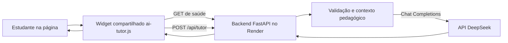

# Arquitetura do Tutor de IA

## Objetivo

O tutor é uma camada de apoio socrático integrada às páginas de simulação. Ele ajuda o estudante a pensar sobre uma questão sem substituir os exercícios, revelar a resposta final ou participar da avaliação da nota.

O site continua estático no GitHub Pages. As chamadas ao modelo passam por um backend FastAPI separado, publicado no Render, para que a chave da DeepSeek não fique no navegador.

## Visão Geral



O índice do site apenas cataloga e liga às páginas. Cada página decide explicitamente se habilita o tutor.

## Componentes

### Página da simulação

Uma página habilita o widget com uma configuração semelhante a esta:

```html
<script>
    window.AI_TUTOR_CONFIG = {
        enabled: true,
        simulationKey: 'efeito-fotoeletrico',
        apiUrl: 'https://tutor-ia-fisica-vrcy.onrender.com/api/tutor'
    };
</script>
<script src="../_shared/ai-tutor.js"></script>
```

A `simulationKey` deve existir no backend. Páginas não configuradas permanecem sem o tutor. O widget procura `#exerciseContainer` e adiciona o botão em um cartão `.exercise` ou `.exercise-card`. Em páginas exploratórias sem quiz, é necessário fornecer um desafio conceitual dentro desse contêiner.

### Widget compartilhado

`_shared/ai-tutor.js` contém a interface reutilizada pelas simulações:

- Injeta o botão de dica no exercício e cria o painel de conversa sob demanda.
- Observa a troca de questão; ao detectar outra questão, limpa o histórico local e reinicia a conversa.
- Fecha o painel quando o modal ou o contêiner do exercício deixa de estar visível.
- Faz a chamada à API somente quando o estudante envia uma mensagem. A saudação inicial é local.
- Antes do POST, consulta a rota de saúde do backend. O resultado positivo fica em cache no navegador por cinco minutos; tentativas de espera duram até 75 segundos.
- Renderiza respostas como texto, sem interpretar HTML arbitrário. Reconhece `**negrito**` criando elementos `<strong>` com conteúdo textual e carrega MathJax sob demanda para fórmulas.

### Backend

`backend-tutor-ia/main.py` implementa o serviço FastAPI:

- `GET /` é a verificação de saúde usada pelo widget.
- `POST /api/tutor` valida a chave da simulação, enunciado, histórico e mensagem.
- `SYSTEM_PROMPT` contém as regras gerais; `SIMULATION_CONTEXTS` acrescenta uma orientação pedagógica específica por simulação.
- O backend combina essas instruções com o enunciado, o histórico recebido e a dúvida atual, e envia a solicitação à API da DeepSeek.
- A chave é lida de `DEEPSEEK_API_KEY` no ambiente do serviço. Ela não deve ser incluída em HTML, JavaScript ou no repositório.
- O histórico não é gravado em banco de dados pelo backend deste protótipo.

## Fluxo de Uma Mensagem

1. O estudante abre o painel e digita uma dúvida.
2. O widget consulta `GET /` para verificar se o Render está disponível.
3. Se a saúde estiver confirmada, o navegador envia `POST /api/tutor` por HTTPS.
4. O FastAPI valida a entrada, aplica o limite por endereço e seleciona o contexto fixo da simulação.
5. O backend chama `https://api.deepseek.com/chat/completions` com a chave secreta.
6. A resposta é validada e devolvida ao widget, que a mostra como texto.

O corpo enviado pelo navegador contém somente:

```json
{
  "simulation_key": "efeito-fotoeletrico",
  "exercise_question": "Enunciado atual do exercício",
  "history": [],
  "message": "Dúvida digitada pelo estudante"
}
```

Nomes, turma, nota, arquivos, formulário escolar ou vídeo não são coletados automaticamente pelo widget. O texto digitado pelo estudante é enviado ao backend e ao provedor de IA; por isso, a orientação é não incluir dados pessoais. A política de retenção do provedor é independente deste código e não é determinada por ele.

No Relatório de Laboratório, o desafio do tutor está em uma seção separada. Os campos de nomes, e-mail, vídeo e relatório não são incluídos automaticamente na chamada. A mensagem escrita pelo próprio usuário continua sendo enviada normalmente.

## Prompt e Comportamento

O prompt geral pede que o modelo:

- Atue como tutor socrático de Física para o Ensino Médio, em português do Brasil.
- Faça uma pergunta curta por resposta e ofereça pistas graduais.
- Não informe a resposta final, valores calculados, alternativa correta ou resolução completa.
- Use os conceitos da simulação atual e não solicite nem repita dados pessoais.

Cada simulação acrescenta orientações próprias, como fórmulas relevantes, hipóteses do modelo, unidades e erros conceituais comuns. O enunciado do exercício é enviado separadamente para que o tutor saiba qual questão está sendo discutida.

A regra de não confirmar ou negar diretamente um resultado que o estudante propôs ainda não está explicitada com essa precisão no prompt geral. A rubrica pedagógica e as conversas de referência são, por enquanto, instrumentos de avaliação manual; não há ajuste fino nem aprendizado automático a partir do feedback.

## Limites e Custos Atuais

Configuração verificada no código:

- Modelo padrão: `deepseek-flash`; `DEEPSEEK_MODEL` pode substituí-lo no ambiente. O código não identifica o modelo como “V4 Flash”.
- `thinking` desativado.
- `max_tokens` definido em 180.
- Timeout de 25 segundos para a chamada à DeepSeek.
- Até 8 mensagens de histórico; cada mensagem do histórico tem limite de 800 caracteres.
- Mensagem atual limitada a 600 caracteres e enunciado a 1.200 caracteres.
- Resposta devolvida pelo backend limitada a 1.200 caracteres.
- `temperature` definida em 0,5 e resposta sem streaming.

O prompt comum é constante, o que mantém um prefixo estável, mas a orientação por simulação muda. O código não envia uma diretiva explícita de cache; qualquer cache de prompt depende do comportamento e das condições oferecidas pelo provedor.

O backend aplica, por padrão, até 120 requisições por minuto por endereço de cliente em uma janela de 60 segundos. Esse contador fica em memória: reinicia com o serviço e não é compartilhado entre várias instâncias. É uma proteção inicial, não um mecanismo completo de autenticação ou controle de orçamento.

## Segurança e Limites

- A chave da DeepSeek permanece no ambiente do Render.
- CORS limita as origens aceitas pelo navegador, mas não autentica clientes nem bloqueia chamadas feitas por outros meios.
- O endpoint é público e não exige login do estudante. Para ampliar o acesso público, seriam necessários limites e monitoramento mais robustos, além de orçamento configurado no provedor.
- O modelo pode falhar, responder incorretamente ou eventualmente contrariar o prompt. As instruções não são uma garantia matemática; conversas de referência e revisão docente continuam importantes.
- Erros de configuração, indisponibilidade e timeout são retornados como erros controlados, sem expor a chave da API.

## Publicação e Configuração

A publicação tem dois componentes independentes:

1. **Frontend:** páginas estáticas e `_shared/ai-tutor.js` são publicados no GitHub Pages.
2. **Backend:** `backend-tutor-ia` é publicado como Web Service no Render.

Variáveis usadas no backend incluem `DEEPSEEK_API_KEY`, `DEEPSEEK_MODEL`, `ALLOWED_ORIGINS` e, opcionalmente, `REQUESTS_PER_MINUTE`. A chave deve ser configurada como segredo no Render.

Ao adicionar uma simulação, é necessário habilitar a página com `AI_TUTOR_CONFIG`, cadastrar a chave em `TutorRequest.simulation_key`, adicionar seu contexto a `SIMULATION_CONTEXTS` e atualizar a documentação. Para a chave nova funcionar online, o backend atualizado precisa ser implantado no Render, além da publicação do frontend no GitHub Pages.

## Arquivos Principais

- `_shared/ai-tutor.js`: interface, detecção de questão, histórico local e comunicação com a API.
- `backend-tutor-ia/main.py`: validação, prompt, contextos, limitação inicial de requisições e chamada à DeepSeek.
- `backend-tutor-ia/README.md`: instruções operacionais de configuração e publicação.
- Páginas em cada pasta de simulação: habilitação individual por `AI_TUTOR_CONFIG`.
