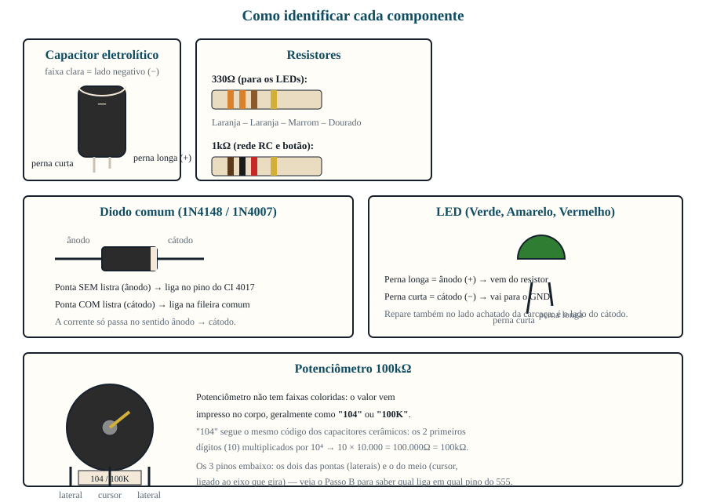
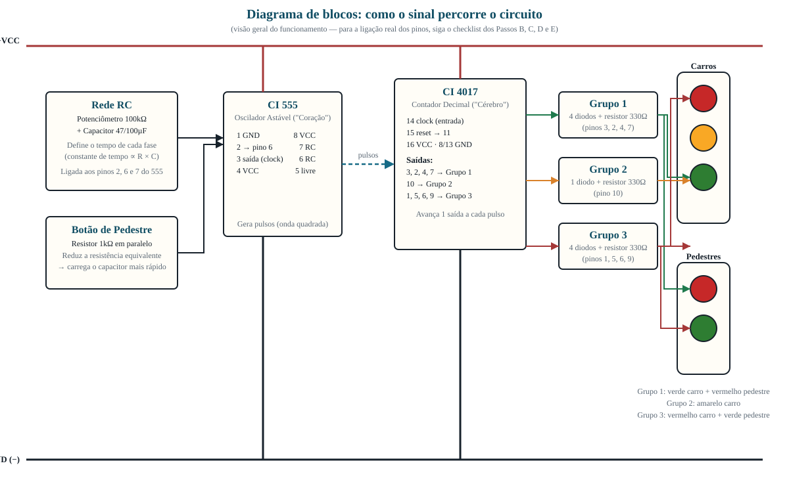
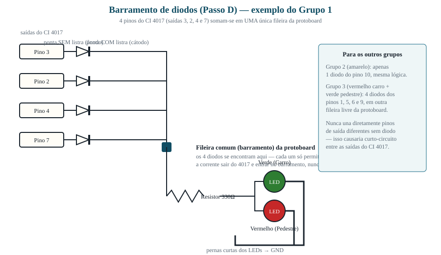

# 🚦 Guia de Experimento: O Semáforo Inteligente Sincronizado
**Disciplina:** Física / Robótica / Eletrodinâmica  
**Público-alvo:** 3º Ano do Ensino Médio  

---

## 📋 Sumário
1. [Fundamentos da Física Aplicada ao Projeto](#1-fundamentos-da-física-aplicada-ao-projeto)
2. [Lista de Materiais](#-2-lista-de-materiais-por-grupo-de-alunos)
3. [Como ler este guia (dica para quem está montando pela 1ª vez)](#-como-ler-este-guia)
4. [Diagrama de Blocos do Circuito](#-diagrama-de-blocos-do-circuito)
5. [Roteiro de Montagem Passo a Passo](#️-3-roteiro-de-montagem-passo-a-passo)
6. [Questionário do Relatório](#-4-questionário-do-relatório)

---

## 1. Fundamentos da Física Aplicada ao Projeto
Antes de iniciar a montagem, é importante compreender o papel de cada componente sob a ótica da Física:
*   **O "Coração" (CI 555):** Funciona como um oscilador elétrico (Modo Astável). Ele dita o ritmo criando uma onda quadrada de pulsos elétricos.
*   **O "Cérebro" (CI 4017):** É um contador decimal digital. A cada pulso de energia que recebe na entrada, ele avança e energiza uma saída diferente (sequência de 0 a 9).
*   **Tempo de Carga e Descarga (O Circuito RC):** O tempo que o semáforo leva para mudar de cor é definido pela interação entre um **Resistor (R)** e um **Capacitor (C)**. A Física nos diz que a constante de tempo é proporcional a R × C. Se aumentamos a resistência (girando o potenciômetro) ou a capacitância, o semáforo fica mais lento.
*   **Associação de Resistores em Paralelo (A Botoeira):** Quando o botão é pressionado, ele liga diretamente os pinos 6 e 7 do 555, colocando uma resistência de quase 0Ω em paralelo com o potenciômetro de 100kΩ. Pela Lei de Ohm, a resistência equivalente desse ramo despenca para quase zero, fazendo o CI 555 oscilar no ritmo mais rápido possível enquanto o botão estiver pressionado — ou seja, o semáforo **pisca acelerado** entre as fases. Não é um salto automático e determinístico para uma cor específica: quem escolhe em qual fase parar é a pessoa, soltando o botão no momento certo. Isso é diferente de um semáforo real de pedestre (que usa um controlador digital com lógica programada) — aqui é uma simplificação didática para observar o efeito de R × C na prática.
*   **Diodos (>|):** Funcionam como válvulas que permitem a corrente elétrica passar em apenas um sentido. São usados para somar os tempos das saídas do chip sem que uma saída interfira na outra (curto-circuito).

---

## 🛒 2. Lista de Materiais (Por Grupo de Alunos)
*   1x Protoboard de 830 pontos
*   1x Circuito Integrado **NE555** (Temporizador)
*   1x Circuito Integrado **CD4017** (Contador)
*   1x Potenciômetro Linear de **100kΩ**
*   1x Capacitor Eletrolítico de **47µF** ou **100µF** (Atenção à polaridade!)
*   1x Botão Táctil (Push-button)
*   1x Resistor de **1kΩ** (Cores: Marrom, Preto, Vermelho) — carga do 555 (Passo B)
*   3x Resistores de **330Ω** (Cores: Laranja, Laranja, Marrom)
*   9x Diodos comuns (ex: **1N4148** ou **1N4007**)
*   5x LEDs Difusos de 5mm (2 Verdes, 2 Vermelhos, 1 Amarelo)
*   Kit de fios jumpers rígidos para conexão
*   1x Fonte para Protoboard MB102 ou Bateria de 9V com Clip

*Confira sempre a polaridade antes de encaixar: capacitor eletrolítico, diodo e LED têm um lado certo — ligá-los invertidos impede o circuito de funcionar (e pode danificar o capacitor).*

## 👀 Como ler este guia
Antes de tocar na protoboard, siga esta ordem — ela evita 90% dos erros de montagem:

1. **Olhe primeiro o diagrama de blocos** (logo abaixo). Ele mostra *o que* cada parte do circuito faz e *como o sinal viaja* — do relógio (555), passando pelo contador (4017), até os LEDs do semáforo. Você não precisa entender cada fio ainda, só o caminho geral.
2. **Depois siga o checklist do Passo A ao Passo E, na ordem.** Cada linha do checklist corresponde a **um único fio ou componente**. Marque a caixinha `[ ]` conforme for conectando — isso evita esquecer ou repetir uma ligação.
3. **Só ligue a energia depois de terminar todos os passos.** Ligar a fonte com o circuito pela metade pode não estragar nada, mas dificulta encontrar erros.
4. **Se algo não acender:** volte ao diagrama de blocos e confira se o problema está na alimentação (VCC/GND), no relógio (555), no contador (4017) ou no grupo de LEDs — isso ajuda a isolar o defeito em vez de refazer o circuito inteiro.

---

## 🖼️ Diagrama de Blocos do Circuito

*Este diagrama é esquemático (mostra a lógica de funcionamento e o caminho do sinal), não a disposição física exata dos pinos na protoboard. Para a ligação física, pino a pino, siga o checklist dos Passos B, C, D e E abaixo — inclusive a "Regra de Ouro" para localizar o Pino 1 de cada chip.*

**Como ler o diagrama:**
*   As linhas **vermelha** (topo) e **preta** (base) são os trilhos de alimentação (+VCC e GND) que percorrem toda a protoboard.
*   A linha tracejada azul mostra o **pulso de clock** saindo do pino 3 do 555 e entrando no pino 14 do 4017 — é esse pulso que faz o contador avançar.
*   As linhas **verde, laranja e vermelha** à direita mostram os três grupos de saída do 4017 (Grupo 1, 2 e 3) e para quais LEDs cada grupo acende — é exatamente a mesma lógica da tabela do Passo D.

---

## 🛠️ 3. Roteiro de Montagem Passo a Passo

### 🛑 Regra de Ouro da Eletrônica:
Para identificar a numeração dos pinos, olhe o chip de cima. Encontre a **meia-lua (entalhe)** ou a **bolinha** na extremidade esquerda. O pino imediatamente abaixo dela é o **Pino 1**. A contagem segue em formato de "U" no sentido anti-horário.

---

### PASSO A: Preparação da Placa e Alimentação
1. Encaixe o **CI 555** no lado esquerdo da fenda central da protoboard.
2. Encaixe o **CI 4017** no lado direito da fenda central.
3. Use fios para interligar as linhas longas superiores (+ e -) às inferiores. **Toda a placa deve ter energia.**

---

### PASSO B: Checklist de Conexões do CI 555 (O Relógio)
*   [ ] **Pino 1:** Ligue direto no **Negativo (GND)**.
*   [ ] **Pino 2:** Interligue com um fio curto diretamente no **Pino 6**.
*   [ ] **Pino 3 (Saída de Sinal):** Puxe um fio longo deste pino e leve até o **Pino 14 do CI 4017**.
*   [ ] **Pino 4:** Ligue direto no **Positivo (VCC)**.
*   [ ] **Pino 5:** Deixe **Vazio / Solto**.
*   [ ] **Pino 6:** Conecte à perna **Positiva (longa)** do capacitor eletrolítico de **47µF** ou **100µF**. *(A perna curta/faixa branca do capacitor vai ao GND).*
*   [ ] **Pino 6:** Conecte também no **pino central** do potenciômetro de 100kΩ.
*   [ ] **Pino 7:** Conecte em um dos **pinos laterais** do potenciômetro.
*   [ ] **Pino 7:** Ligue um resistor de **1kΩ** deste pino até a linha do **Positivo (VCC)**.
*   [ ] **Pino 8:** Ligue direto no **Positivo (VCC)**.

---

### PASSO C: Checklist de Conexões do CI 4017 (O Contador)
*   [ ] **Pino 16:** Ligue direto no **Positivo (VCC)**.
*   [ ] **Pino 8 e Pino 13:** Ligue ambos direto no **Negativo (GND)**.
*   [ ] **Pino 15 (Reset):** Ligue um fio curto dele direto para o **Pino 11**. *(Isso faz o semáforo reiniciar no tempo certo).*
*   [ ] **Pino 14 (Clock):** Garanta que ele está recebendo o fio vindo do **Pino 3 do 555**.

---

### PASSO D: Matriz de Lógica dos Diodos e LEDs
*Atenção à polaridade: Diodos possuem uma listra que indica a saída da corrente elétrica. LEDs possuem a perna longa como positiva.*

*Cada grupo abaixo repete a mesma lógica do diagrama: vários pinos de saída → um diodo cada → todos se encontram em uma fileira comum → um resistor de 330Ω → os LEDs daquele grupo → GND.*

#### 🚗 Verde dos Carros & 🚶 Vermelho dos Pedestres (Tempo 1)
*   [ ] Pegue **4 diodos**. Conecte a ponta SEM listra de cada um nos pinos: **3, 2, 4 e 7** do 4017.
*   [ ] Una as 4 pontas COM listra desses diodos em uma fileira vaga da protoboard.
*   [ ] Nessa junção, coloque um resistor de **330Ω**.
*   [ ] Na saída do resistor, ligue a perna longa do **LED Verde (Carros)** e a perna longa do **LED Vermelho (Pedestres)**.
*   [ ] As pernas curtas de ambos os LEDs vão para o **Negativo (GND)**.

#### 🚗 Amarelo dos Carros (Tempo 2)
*   [ ] Pegue **1 diodo**. Conecte a ponta SEM listra no **Pino 10** do 4017.
*   [ ] Conecte a ponta COM listra em uma fileira vaga, junto com um resistor de **330Ω**.
*   [ ] Ligue o resistor na perna longa do **LED Amarelo (Carros)**. A perna curta vai ao **Negativo (GND)**.

#### 🚗 Vermelho dos Carros & 🚶 Verde dos Pedestres (Tempo 3)
*   [ ] Pegue **4 diodos**. Conecte a ponta SEM listra de cada um nos pinos: **1, 5, 6 e 9** do 4017.
*   [ ] Una as 4 pontas COM listra em uma nova fileira vaga da protoboard.
*   [ ] Nessa junção, coloque o último resistor de **330Ω**.
*   [ ] Na saída do resistor, ligue a perna longa do **LED Vermelho (Carros)** e a perna longa do **LED Verde (Pedestres)**.
*   [ ] As pernas curtas de ambos os LEDs vão para o **Negativo (GND)**.

---

### PASSO E: Implementando o Botão de Pedestre (Botoeira)
*   [ ] Encaixe o botão táctil em um espaço livre da protoboard.
*   [ ] Puxe um fio de um dos pinos do botão até o **Pino 7 do CI 555**.
*   [ ] Puxe um fio do outro pino do botão e leve direto para o **Pino 6 do CI 555**.
*   [ ] Não é preciso nenhum resistor extra nessa ligação: ao pressionar, o botão liga o pino 6 direto ao pino 7, colocando um caminho de resistência quase nula em paralelo com o potenciômetro. Isso faz o circuito oscilar bem mais rápido enquanto o botão está pressionado — o semáforo pisca acelerado entre as fases, e soltar o botão no momento certo é o que permite "escolher" parar no amarelo ou no vermelho.

---

## 📝 4. Questionário do Relatório

> As respostas abaixo foram organizadas para serem coladas diretamente nos campos do **Relatório de Laboratório 1** ([`RelatorioLaboratorio_1.html`](https://flavioambrosios.github.io/simulacoes/RelatorioLaboratorio/RelatorioLaboratorio_1.html)). Cada bloco corresponde a um campo do formulário.
>
> 💡 **Dica:** para não perder este guia de vista, abra o relatório em outra aba: segure **Ctrl** (Windows/Linux) ou **Cmd** (Mac) ao clicar no link acima — ou clique com o botão direito e escolha "Abrir link em nova aba".

### 2. Introdução *(campo "Introdução" do relatório)*
Apresentem o experimento: o que é um semáforo controlado por CI 555 + CI 4017 e qual conceito de Física ele demonstra (circuitos RC, lógica digital sequencial, associação de resistores).

### 3. Objetivos *(campo "Objetivos" do relatório)*
Descrevam o que o grupo pretendia observar ou verificar ao montar o circuito. Sugestão de objetivos:
*   Observar o efeito do circuito RC (R × C) no tempo de cada fase do semáforo.
*   Verificar a função dos diodos como "válvulas" que evitam curto-circuito entre saídas do CI 4017.
*   Analisar o efeito da associação de resistores em paralelo ao acionar o botão de pedestre.

### 4. Descrição da experiência *(campo "Descrição" do relatório)*
Descrevam, com suas palavras, como montaram o circuito (Passos A a E) e como testaram seu funcionamento (o que aconteceu ao ligar a fonte, ao girar o potenciômetro e ao apertar o botão).

### 5. Materiais utilizados *(campo "Materiais" do relatório)*
Copiem e adaptem a lista de materiais da seção 2 deste guia (protoboard, NE555, CD4017, potenciômetro, capacitor, resistores, diodos, LEDs, botão e fonte).

### 6. Análise e resultados *(campo "Análise" do relatório)*
Respondam às três perguntas abaixo — elas devem compor o corpo da análise:

1.  **Explique o que acontece com a velocidade de piscada do semáforo quando giramos o potenciômetro.** Use o conceito de circuito RC (Resistência e Capacitância) na resposta.
2.  **Por que foi necessário utilizar diodos no circuito do CI 4017?** O que aconteceria com o circuito elétrico se ligássemos os pinos de saída do chip direto uns nos outros sem diodos?
3.  **Analise a botoeira:** do ponto de vista da associação de resistores, explique fisicamente por que o semáforo pisca muito mais rápido quando pressionamos o botão de pedestre, e por que o momento de soltar o botão é o que determina em qual fase (amarelo ou vermelho) o semáforo vai parar.

### 7. Conclusão *(campo "Conclusão" do relatório)*
Retomem os objetivos e expliquem, com base na análise, se o circuito confirmou (ou não) os conceitos de Física estudados (RC, lógica sequencial, associação de resistores).