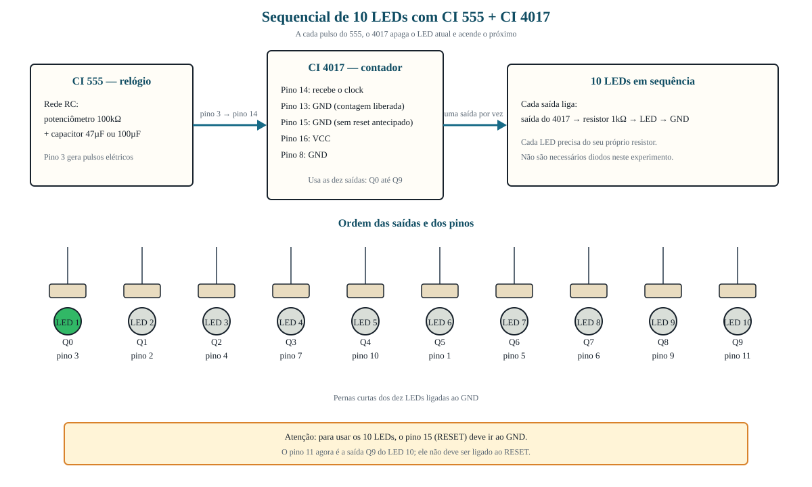
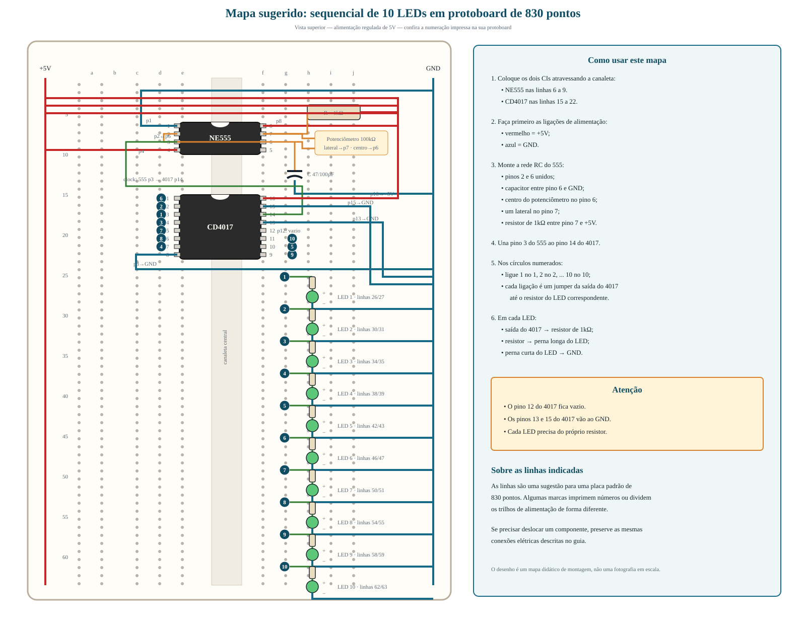
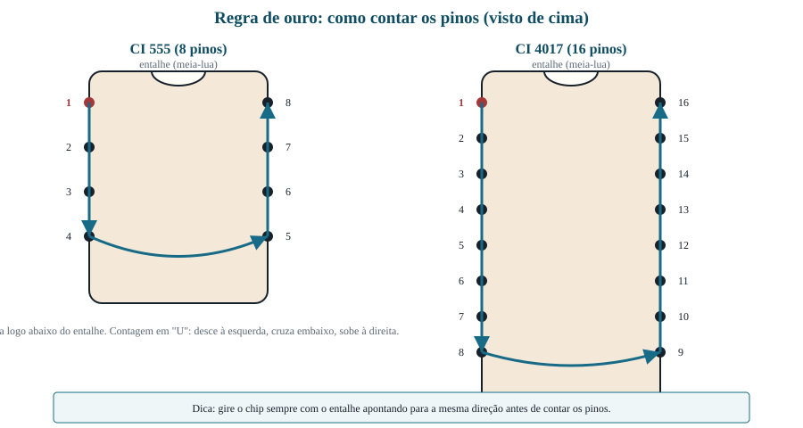

# 💡 Guia de Experimento: Fita Sequencial de 10 LEDs

**Disciplina:** Física / Robótica / Eletrodinâmica  
**Público-alvo:** 3º Ano do Ensino Médio  

---

## 📋 Sumário

1. [Fundamentos da Física Aplicada ao Projeto](#1-fundamentos-da-física-aplicada-ao-projeto)
2. [Lista de Materiais](#2-lista-de-materiais-por-grupo-de-alunos)
3. [Como ler este guia](#3-como-ler-este-guia)
4. [Diagrama de Blocos](#4-diagrama-de-blocos-do-circuito)
5. [Roteiro de Montagem](#5-roteiro-de-montagem-passo-a-passo)
6. [Teste e Diagnóstico](#6-teste-e-diagnóstico)
7. [Questionário do Relatório](#7-questionário-do-relatório)

---

## 1. Fundamentos da Física Aplicada ao Projeto

Neste experimento, dez LEDs acendem um após o outro, produzindo um efeito de luz em movimento. Dois circuitos integrados realizam esse trabalho:

* **CI 555 — o relógio:** funciona como um oscilador em modo astável. Ele produz pulsos elétricos continuamente no pino 3.
* **CI 4017 — o contador:** recebe os pulsos no pino 14. A cada novo pulso, desliga a saída atual e liga a saída seguinte: Q0, Q1, Q2, até Q9. Depois de Q9, retorna automaticamente a Q0.
* **Circuito RC — o controle de velocidade:** o potenciômetro e o capacitor determinam o intervalo entre os pulsos. Quanto maior a resistência ou a capacitância, maior o tempo entre os pulsos e mais lenta fica a sequência.
* **Resistores dos LEDs:** limitam a corrente elétrica e protegem tanto os LEDs quanto as saídas do CI 4017. Cada LED deve possuir seu próprio resistor.
* **Conversão de energia:** os LEDs transformam energia elétrica principalmente em luz e também em uma pequena quantidade de energia térmica.

Uma forma simplificada de representar a dependência do tempo é:

$$
T \propto R \times C
$$

Assim, aumentar o valor ajustado no potenciômetro aumenta o período $T$ e diminui a velocidade aparente do movimento luminoso.

---

## 2. Lista de Materiais (Por Grupo de Alunos)

* 1x Protoboard de 830 pontos
* 1x Circuito Integrado **NE555** (temporizador)
* 1x Circuito Integrado **CD4017** (contador decimal)
* 1x Potenciômetro Linear de **100kΩ**
* 1x Capacitor Eletrolítico de **47µF** ou **100µF**
* 11x Resistores de **1kΩ** (cores: Marrom, Preto, Vermelho): 1 para o circuito do CI 555 e 10 para os LEDs
* 10x LEDs de 5mm (podem ser da mesma cor ou de cores variadas)
* Kit de fios jumpers rígidos
* 1x Fonte regulada de **5V** para protoboard

> **Por que usar resistores de 1kΩ nos LEDs?** Eles mantêm a corrente em um valor mais seguro para as saídas do CD4017. Não ligue um LED diretamente ao CI. **Atenção à polaridade:** no capacitor eletrolítico, a faixa lateral indica o terminal negativo. No LED, a perna longa é o ânodo (+) e a perna curta é o cátodo (−).

---

## 3. Como ler este guia

1. Observe primeiro o diagrama de blocos e identifique o caminho do sinal: **555 → 4017 → resistor → LED → GND**.
2. Monte uma etapa por vez e marque cada caixa `[ ]` depois de conferir a ligação.
3. Mantenha a fonte desligada durante toda a montagem.
4. Antes de ligar, confira especialmente os pinos 8, 13, 14, 15 e 16 do CI 4017.
5. Se a sequência falhar, use a seção [Teste e Diagnóstico](#6-teste-e-diagnóstico) em vez de desmontar tudo.

---

## 4. Diagrama de Blocos do Circuito

**Ponto mais importante:** neste experimento, o CI 4017 precisa utilizar todas as dez saídas. Por isso, o **pino 15 (RESET) vai ao GND**. O **pino 11 é usado como saída Q9 para o LED 10**.

### Mapa de montagem no protoboard de 830 pontos

Este mapa usa como referência uma protoboard padrão com colunas **a–e** de um lado da canaleta e **f–j** do outro. Algumas marcas apresentam pequenas diferenças na numeração e nos trilhos de alimentação.

Posição sugerida dos CIs, sempre com o entalhe voltado para cima:

* **NE555:** atravesse a canaleta central ocupando as linhas 6 a 9. Assim, os pinos 1–4 ficam no lado **e** e os pinos 5–8 no lado **f**.
* **CD4017:** atravesse a canaleta central ocupando as linhas 15 a 22. Assim, os pinos 1–8 ficam no lado **e** e os pinos 9–16 no lado **f**.

Para reduzir o cruzamento de fios, o mapa usa pares numerados. Ligue **1 ao 1, 2 ao 2, até 10 ao 10**. Cada par representa um jumper entre a saída do CD4017 e o resistor do LED correspondente.

#### Posições sugeridas para a fita de LEDs

Use o lado **f–j** da protoboard. Em cada conjunto, coloque o resistor verticalmente entre a linha de entrada e a linha do ânodo. Coloque o LED entre a linha do ânodo e a linha do cátodo.

| LED | Saída | Pino do 4017 | Entrada do resistor | Saída do resistor e ânodo (+) | Cátodo (−) |
| ---: | :---: | ---: | :---: | :---: | :---: |
| 1 | Q0 | 3 | linha 24 | linha 26 | linha 27 |
| 2 | Q1 | 2 | linha 28 | linha 30 | linha 31 |
| 3 | Q2 | 4 | linha 32 | linha 34 | linha 35 |
| 4 | Q3 | 7 | linha 36 | linha 38 | linha 39 |
| 5 | Q4 | 10 | linha 40 | linha 42 | linha 43 |
| 6 | Q5 | 1 | linha 44 | linha 46 | linha 47 |
| 7 | Q6 | 5 | linha 48 | linha 50 | linha 51 |
| 8 | Q7 | 6 | linha 52 | linha 54 | linha 55 |
| 9 | Q8 | 9 | linha 56 | linha 58 | linha 59 |
| 10 | Q9 | 11 | linha 60 | linha 62 | linha 63 |

Em cada linha de cátodo, use um jumper até o trilho GND. Os furos de uma mesma linha, do lado **f–j**, já são interligados internamente.

> **Importante:** não coloque as duas pernas do LED na mesma linha horizontal, pois elas ficariam eletricamente unidas. Use as duas linhas consecutivas indicadas na tabela.

---

## 5. Roteiro de Montagem Passo a Passo

### Regra de Ouro: numeração dos pinos

Observe os CIs por cima, com o entalhe (meia-lua) voltado para cima. O pino 1 fica imediatamente à esquerda do entalhe. A numeração segue em formato de “U”, no sentido anti-horário.

---

### PASSO A: Preparação da protoboard

1. Encaixe o **CI 555** atravessando a fenda central da protoboard.
2. Encaixe o **CI 4017** também atravessando a fenda central, deixando espaço para os jumpers.
3. Separe uma linha de alimentação para **+5V (VCC)** e outra para **GND (−)**.
4. Se os trilhos de alimentação forem interrompidos no meio, una as duas metades com jumpers.

---

### PASSO B: Checklist do CI 555 (gerador de pulsos)

* [ ] **Pino 1:** ligue ao **GND**.
* [ ] **Pino 2:** interligue diretamente ao **pino 6**.
* [ ] **Pino 3 (saída):** ligue ao **pino 14 do CI 4017**.
* [ ] **Pino 4:** ligue ao **VCC**.
* [ ] **Pino 5:** deixe sem ligação.
* [ ] **Pino 6:** ligue à perna positiva (longa) do capacitor de **47µF ou 100µF**.
* [ ] Ligue a perna negativa do capacitor (lado da faixa) ao **GND**.
* [ ] **Pino 6:** ligue também ao **pino central do potenciômetro**.
* [ ] **Pino 7:** ligue a um dos **pinos laterais do potenciômetro**.
* [ ] Deixe o outro pino lateral do potenciômetro sem ligação.
* [ ] **Pino 7:** ligue também a um resistor de **1kΩ**; a outra ponta do resistor vai ao **VCC**.
* [ ] **Pino 8:** ligue ao **VCC**.

---

### PASSO C: Checklist do CI 4017 (contador de dez saídas)

* [ ] **Pino 16:** ligue ao **VCC**.
* [ ] **Pino 8:** ligue ao **GND**.
* [ ] **Pino 13 (Clock Enable):** ligue ao **GND** para liberar a contagem.
* [ ] **Pino 14 (Clock):** confira a ligação vinda do **pino 3 do CI 555**.
* [ ] **Pino 15 (RESET):** ligue ao **GND** para permitir a contagem de Q0 até Q9.

> **Não ligue o pino 15 ao pino 11.** Essa ligação reiniciaria a contagem antes de utilizar corretamente a décima saída.

---

### PASSO D: Montagem dos 10 LEDs

Para cada saída, repita esta ligação:

#### Ligação repetida em cada saída

`Pino do CI 4017 → resistor de 1kΩ → perna longa do LED → perna curta do LED → GND`

| Ordem | Saída do 4017 | Pino do 4017 | Ligação |
| ---: | :---: | ---: | :--- |
| 1 | Q0 | 3 | pino 3 → resistor → LED 1 → GND |
| 2 | Q1 | 2 | pino 2 → resistor → LED 2 → GND |
| 3 | Q2 | 4 | pino 4 → resistor → LED 3 → GND |
| 4 | Q3 | 7 | pino 7 → resistor → LED 4 → GND |
| 5 | Q4 | 10 | pino 10 → resistor → LED 5 → GND |
| 6 | Q5 | 1 | pino 1 → resistor → LED 6 → GND |
| 7 | Q6 | 5 | pino 5 → resistor → LED 7 → GND |
| 8 | Q7 | 6 | pino 6 → resistor → LED 8 → GND |
| 9 | Q8 | 9 | pino 9 → resistor → LED 9 → GND |
| 10 | Q9 | 11 | pino 11 → resistor → LED 10 → GND |

Checklist de conferência:

* [ ] Cada LED possui **seu próprio resistor de 1kΩ**.
* [ ] Todas as pernas curtas dos LEDs estão ligadas ao **GND**.
* [ ] Nenhuma saída do 4017 foi ligada diretamente a outra saída.
* [ ] Os LEDs seguem fisicamente a ordem da tabela, mesmo que os números dos pinos pareçam “fora de ordem”.

---

### PASSO E: Inspeção antes de ligar

* [ ] Os dois CIs estão orientados corretamente pelo entalhe.
* [ ] O capacitor eletrolítico está com a polaridade correta.
* [ ] O pino 15 do 4017 está no GND.
* [ ] O pino 13 do 4017 está no GND.
* [ ] Cada LED possui um resistor em série.
* [ ] Não há jumper unindo diretamente VCC e GND.

Depois da conferência, ajuste o potenciômetro aproximadamente no meio e ligue a fonte.

---

## 6. Teste e Diagnóstico

### Funcionamento esperado

1. Somente um LED deve ficar aceso por vez.
2. A sequência deve seguir LED 1 → LED 2 → ... → LED 10 → LED 1.
3. Ao girar o potenciômetro, a sequência deve ficar mais rápida ou mais lenta.

### Se nenhum LED acender

* Confira VCC e GND dos dois CIs.
* Confira a polaridade dos LEDs e do capacitor.
* Confira se o pino 13 do 4017 está no GND.

### Se apenas um LED ficar aceso

* Confira o fio do pino 3 do 555 até o pino 14 do 4017.
* Confira as ligações do potenciômetro, do capacitor e dos pinos 2, 6 e 7 do 555.
* Gire lentamente o potenciômetro para verificar se a sequência estava apenas muito lenta.

### Se a sequência pular um LED

* Confira o pino correspondente na tabela do Passo D.
* Verifique se o LED está invertido ou mal encaixado.
* Teste o LED separadamente com um resistor, pois ele pode estar danificado.

### Se os LEDs acenderem fora da ordem física

O CI provavelmente está contando corretamente, mas os LEDs foram posicionados em uma ordem diferente da tabela. Reorganize os jumpers das saídas, sem alterar a alimentação do CI.

---

## 7. Questionário do Relatório

> As respostas podem ser utilizadas nos campos do **Relatório de Laboratório 1** ([`RelatorioLaboratorio_2.html`](https://flavioambrosios.github.io/simulacoes/RelatorioLaboratorio/RelatorioLaboratorio_2.html)). Para manter este guia aberto, use **Ctrl + clique** no link ou escolha “Abrir link em nova aba”.

### 2. Introdução *(campo “Introdução”)*

Apresentem o experimento e expliquem, resumidamente, como o CI 555 e o CI 4017 produzem uma sequência luminosa.

### 3. Objetivos *(campo “Objetivos”)*

Sugestões:

* Montar um circuito sequencial utilizando os CIs 555 e 4017.
* Observar a relação entre os pulsos do 555 e a mudança das saídas do 4017.
* Investigar o efeito da resistência e da capacitância sobre o intervalo de tempo entre os LEDs.
* Identificar a função do resistor de proteção ligado a cada LED.

### 4. Descrição da experiência *(campo “Descrição”)*

Descrevam a montagem dos CIs, do circuito RC e dos dez LEDs. Relatem também como a sequência foi testada e como o potenciômetro foi ajustado.

### 5. Materiais utilizados *(campo “Materiais”)*

Copiem e adaptem a lista da seção 2, registrando os valores realmente usados pelo grupo.

### 6. Análise e resultados *(campo “Análise”)*

Respondam:

1. O que aconteceu com a velocidade da sequência quando o potenciômetro foi girado? Explique usando a relação $T \propto R \times C$.
2. Qual é a função do CI 555 e qual é a função do CI 4017 neste circuito?
3. Por que cada LED precisa de um resistor em série?
4. Por que o pino 15 (RESET) do CI 4017 foi ligado ao GND neste experimento?
5. A sequência observada seguiu a ordem Q0 até Q9? Registrem qualquer falha e expliquem como ela foi corrigida.

### 7. Conclusão *(campo “Conclusão”)*

Retomem os objetivos e expliquem se o circuito demonstrou a geração de pulsos, a contagem sequencial e a influência do circuito RC sobre o tempo.
